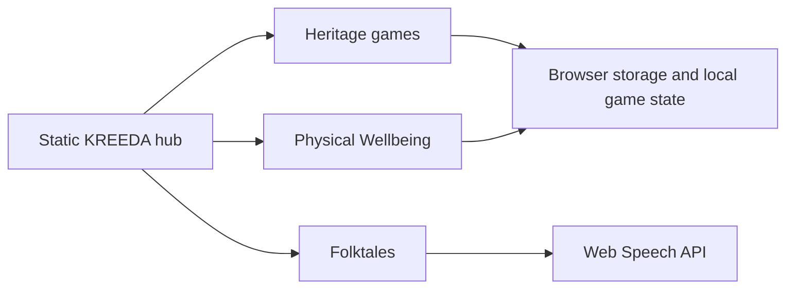

<div align="center">

# KREEDA

### India's traditional games, movement practices and stories, gathered into one offline-first learning space.


Built for **Smart India Hackathon (SIH) 2026**.

</div>

---

## What is KREEDA?

KREEDA is a browser-based cultural learning platform for children, families and classrooms. It brings together traditional Indian board games, guided physical wellbeing practices and illustrated folktales in a single, approachable hub.

The experience is designed for low-connectivity environments: there are no accounts, no backend services and no required network calls during play. Progress and preferences stay on the learner's device.

## Explore

### Heritage games

Play and learn the stories behind six traditional games:

- **Chaturangam** — a strategic board game with a modern React interface, tutorials and an AI opponent.
- **Vaikunthapali** — the historic snake-and-ladder tradition with cultural context and board guidance.
- **Puli Meka** — a hunt-and-escape strategy game.
- **Daadi Aata** — a traditional chase game with a folk-art presentation.
- **Vaamana Guntalu** — a classic pit-and-counter game.
- **Ashta Chamma** — a race game built around a traditional Indian board.

Each game can stand alone, while the hub provides a consistent way to discover games, rules, maps and tutorials.

### Physical Wellbeing

The Wellbeing module combines three traditions:

- **Yoga** — asanas, breathing practices, history and a guided session library.
- **Vyayam** — Dand, Baithak, mobility work and akhada heritage.
- **Dhyana** — meditation practices across Buddhist, Vedic, Jain and Yogic traditions.

The module includes a deterministic weekly plan builder, safety and contraindication checks, progressive practice unlocks, timed sessions, mood check-ins and local progress history. It does not make medical claims or send health data to a server.

### Folktales

The story library contains illustrated tales from Panchatantra, Tenali Ramakrishna, Vikram-Betal, Paramanandayya's disciples, freedom-fighter stories and festivals. Stories can be read in the browser and narrated sentence by sentence using the Web Speech API.

## How it works




- The top-level HTML pages provide navigation and the shared visual language.
- React + TypeScript modules are built independently with Vite.
- Game rules, AI and plan selection run in the browser.
- Wellbeing data and game preferences use `localStorage`.
- React modules can be embedded in the hub with the existing `postMessage` integration.

## Run it locally

### Open the hub

From the repository root:

```bash
python3 -m http.server 8000
```

Open <http://localhost:8000/kreeda-home.html>.

The built modules are committed, so the hub works right away. To rebuild a module after changing it:

```bash
cd games/chaturangam
npm install
npm run build

cd ../../wellbeing
npm install
npm run build
```

### Develop Chaturangam

```bash
cd games/chaturangam
npm install
npm run dev
```

Open <http://localhost:3001>.

### Develop Physical Wellbeing

```bash
cd wellbeing
npm install
npm run dev
```

Open <http://localhost:3002>.

### Rebuild folktales

After editing story source files:

```bash
node folktales/build-stories.mjs
```

## Project layout

```text
Kreeda/
├── kreeda-home.html        Main hub: Games, Wellbeing and Folktales
├── kreeda.html             Games catalogue, maps and tutorials
├── folktales.html          Folktale library and reader
├── assets/
│   └── images/             Hub backgrounds, cards, mascot and game artwork
├── js/                     Shared scripts: i18n, game maps, world-atlas data
├── games/
│   ├── chaturangam/        React + TypeScript chess-family game and engine
│   ├── vaikunthapali/      React + TypeScript snakes-and-ladders
│   ├── puli-meka/          React + TypeScript hunt game
│   ├── daadi-aata/         React + TypeScript mill game
│   ├── ashta-chamma/       React + TypeScript race game
│   └── vamana-guntalu/     Standalone HTML pit-and-counter game
├── wellbeing/              React + TypeScript Yoga, Vyayam and Dhyana module
├── folktales/              Story sources, generated data and build scripts
└── docs/                   Architecture diagram and project documentation
```

Each React module builds into its own `dist/` folder, which is committed so the hub works straight from a fresh clone. After changing a module, run `npm run build` in it and commit the updated `dist/`.

## Useful commands

```bash
# Serve the hub
python3 -m http.server 8000

# React module checks and builds
cd games/chaturangam && npm run lint && npm run build
cd ../../wellbeing && npm run lint && npm run build

# Rebuild generated story data
node folktales/build-stories.mjs
```

## Privacy and offline behaviour

- No account or sign-in is required.
- No application backend is required to play, read or practise.
- Wellbeing profiles, plans, moods and session history remain in browser `localStorage`.
- Narration uses the browser's local Web Speech API when available.
- A local HTTP server is recommended for modules that load separate scripts or built assets.

## Roadmap

- Add more regional languages to rules, stories and wellbeing guidance.
- Convert remaining legacy game pages to consistent Vite builds.
- Expand the folktale and heritage-game collections.
- Add reviewed movement animations and richer classroom facilitation tools.

## Contributing

Keep new content local-first, cite historical and health-related sources, preserve the shared folk-art visual language and test the affected module with its `lint` and `build` commands before opening a change.
