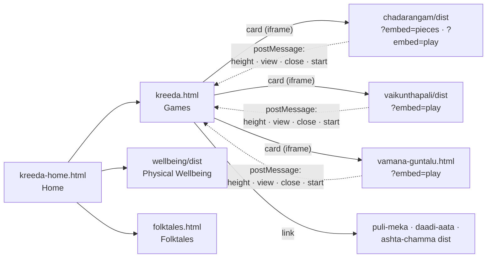
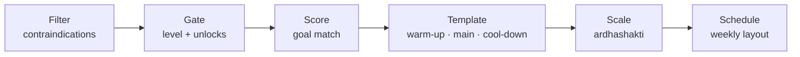

# KREEDA · క్రీడ

**India's traditional games, fitness and stories in one offline-first app.** Six heritage board games you can play against an AI mascot, a personal Yoga · Vyayam · Dhyana plan, and illustrated folktales read aloud by Grandmother. It needs no internet connection, account or server.

Built for **Smart India Hackathon (SIH) 2026**.

| | |
|---|---|
| **Problem statement** | _SIH PS ID and title_ <!-- fill in --> |
| **Theme** | _e.g. Heritage & Culture / Toys & Games_ <!-- fill in --> |
| **Category** | Software |
| **Team** | _Team name · members_ <!-- fill in --> |

**Stack:** React 18/19 + TypeScript + Vite + Tailwind CSS v4 (game and fitness modules) · plain HTML/CSS/JS (hub, Folktales, Vaamana Guntalu) · Web Speech API (narration) · `localStorage` (progress) · single-file builds, no backend and no database.

---

## 1. Run it

### Quickest: open it from a local server (recommended)
Every module is prebuilt into its `dist/` folder, so there's **nothing to install or build** to try the app.

From the `Kreeda` folder:

```bash
# macOS / Linux (Python is built in)
python3 -m http.server 8000

# or, with Node.js installed
npx serve .
```

Open **http://localhost:8000/kreeda-home.html** (or the address `serve` prints).

> **Opening by double-click:** the home page, Games page, Folktales, Physical Wellbeing, Chaturangam, Vaikunthapali and Vaamana Guntalu all work straight from the file (`file://`). **Puli Meka, Daadi Aata and Ashta Chamma still need the local server above**, because browsers block their split script files over `file://`. See [Known limitations](#8-known-limitations).

### Where things are

| Page | File |
|---|---|
| Home: the three modules | `kreeda-home.html` |
| Games: all six games, maps, rules, Play | `kreeda.html` |
| Folktales | `folktales.html` |
| Physical Wellbeing | `wellbeing/dist/index.html` |
| A single game on its own | `chadarangam/dist/index.html`, `games/<game>/dist/index.html`, `games/vamana-guntalu/vamana-guntalu.html` |

### Rebuild a module after changing its code
Only needed for the React modules (`chadarangam/`, `wellbeing/`, `games/vaikunthapali/`, `games/puli-meka/`, `games/daadi-aata/`, `games/ashta-chamma/`):

```bash
cd chadarangam        # or any module above
npm install           # first time only
npm run dev           # live-reload development server
npm run build         # writes dist/; the hub links straight to it
```

Requires **Node.js 20 LTS or newer**. The hub, Folktales and Vaamana Guntalu are plain HTML with no build step.

### Troubleshooting

| Symptom | Fix |
|---|---|
| A game opens to a blank page | Open the app through the local server (above), not by double-clicking |
| `vite: Permission denied` / `tsc: Permission denied` | `chmod +x node_modules/.bin/*` in that module, or delete `node_modules` and run `npm install` again |
| A game in the Games page opens but looks outdated | Run `npm run build` in that game's folder; the page loads `dist/` |
| Grandmother reads in an unexpected voice | Pick another from the **Voice** list in the story; it depends on the voices installed on the device |
| Fonts look plain when offline | Expected: the Google Fonts load online only; everything else works the same |

---

## 2. What's inside

### 🎲 Games: six traditional Indian board games, each with its journey across the world

| Game | Also known as | Play | Kreedu's AI |
|---|---|---|---|
| **Vaikunthapali** (వైకుంఠపాళి) | Gyan Chauper, Moksha Patam → Snakes & Ladders | Solo (timed) or vs Kreedu | Dice race; ladders are virtues, snakes are vices |
| **Chaturangam** (చతురంగం) | Chadarangam, Shatranj → Chess | vs Kreedu or 2 players · Chaturangam **and** modern Chess | Iterative-deepening search (PVS, null-move pruning, quiescence, Zobrist hashing) · Sishya / Yodha / Senapati |
| **Puli Meka** (పులి మేక ఆట) | Aadu Puli Aatam, Bagh-Chal | vs Kreedu | Time-boxed game-tree search with a transposition table |
| **Daadi Aata** (దాడి ఆట) | Navakankari, Nine Men's Morris | vs Kreedu | Minimax with alpha-beta pruning |
| **Vaamana Guntalu** (వామన గుంటలు) | Pallanguzhi (mancala family) | vs Kreedu | Two-ply lookahead: picks the sowing with the best worst-case reply |
| **Ashta Chamma** (అష్ట చెమ్మ) | Chowka Bara, Daayam | vs Kreedu | Rule-based: capture first, then reach home, then advance furthest |

**Every game page has:**
- **A world map with six pins** tracing where the game travelled and what it's called there, each with a fact and the story of how it arrived. Daadi Aata is the deliberate exception: it arose independently in several ancient civilizations, so its pins aren't joined by a path.
- **Rules, a tutorial, and Easy / Medium / Hard.** The difficulty is remembered per game.
- **Play in a card on the same page.** Chaturangam, Vaikunthapali and Vaamana Guntalu open their tutorial, match setup and board in a card over the Games page, sized to fit the screen without scrolling.

**Chaturangam highlights:** an interactive piece-movement tutorial, moves that slide from square to square with an arrow and markers for the last move, Kreedu announcing its move in words ("Kreedu moved Ashva b8 → c6, taking your Padati"), a move log, undo, hints and promotion.

**Vaikunthapali** is playable in **Telugu, English, Hindi, Tamil and Malayalam**, with a board guide explaining each virtue ladder and vice snake.

### 🧘 Physical Wellbeing: Yoga, Vyayam and Dhyana in one plan
- **Practice library:** 30 asanas, 4 loosening drills, 2 Surya Namaskar variants and 4 pranayama (Yoga); Dand, Baithak, Sapate and mobility drills (Vyayam); 7 meditation practices from Buddhist, Vedic, Jain and Yogic traditions (Dhyana). Each has steps, cautions, contraindications and sources, and many have step images and demo animations.
- **A personal weekly plan** from a five-step builder (concerns → body data → health checklist → time → review). A **deterministic, rule-based engine** handles it (**no ML, no network**): filter out contraindicated practices → gate by fitness level → score by goal → fit a warm-up / main / cool-down time budget → scale intensity by the *ardhashakti* (half-strength) principle → lay out the week.
- **Session player** with a silent countdown and a bell tone, a mood check before and after, progress and streaks, and a private mood journal.
- **Heritage content:** history timelines, fun facts, maps showing where each tradition spread, and cards on Mudgar, Gada, Kushti, Mallakhamb and Kalaripayattu.

### 📖 Folktales: stories told by Grandmother
- **12 illustrated stories in 6 collections:** Tenali Ramakrishna, Vikram Bhetal, Panchatantra, Paramanandayya Sishyulu, Freedom Fighters, Festival Stories.
- **Read aloud** with the browser's built-in speech (Web Speech API). Each sentence is highlighted as it's read, you can tap any sentence to start from there, there are 0.75× to 1.5× speeds and a voice picker, and it prefers an Indian English voice when the device has one.
- **Grandmother is animated only while she's speaking.** She holds still when narration is paused, not started or finished.
- Each story ends with a *Did you know?* note and *What the story teaches*.
- Library and reader open in a card over the Grandmother page. The browser's Back button steps from story to list to closed, and story links can be shared.

---

## 3. Why it matters

| | |
|---|---|
| **Preserving intangible heritage** | Games like Vaamana Guntalu, Puli Meka and Ashta Chamma are fading from everyday play. KREEDA keeps their rules, names and history in one place, alongside the stories and fitness traditions they grew up with. It connects to **Indian Knowledge Systems (IKS)**. |
| **Learning through play** | Board games build logic, counting and planning, in line with **NEP 2020**'s push for toy- and game-based, experiential learning. The maps teach history and geography along the way. |
| **Works where the internet doesn't** | Offline-first by design: every game, the fitness plan and the stories run with **zero connectivity**, for rural and low-bandwidth users, classrooms and community centres. |
| **Rooted in Indian languages** | Telugu names throughout the app, and a Vaikunthapali board in five Indian languages. |
| **Private by default** | No sign-up, no server, no tracking. Progress, plans and mood entries stay in the device's own storage. |
| **Safe fitness guidance** | Contraindications are filtered first, advanced asanas are locked behind experience, benefits are described as "traditionally associated with", never as a cure, and a doctor-consult acknowledgment is required for health flags. |

**What makes it different:** most "100 offline games" apps are stripped-down clones. KREEDA puts each game's **journey across the world** on a map, pairs it with the **stories and fitness practices** of the same culture, and gives it a single character (**Kreedu**) who is both your guide and your opponent.

---

## 4. How it works

### Architecture: a static hub that embeds self-contained modules



- **Each module is independent.** Each game or module is its own small app with its own build, so teams can work in parallel and one module can't break another.
- **Single-file builds.** Chaturangam, Vaikunthapali and Wellbeing compile their JavaScript and CSS into one `index.html` (`vite-plugin-singlefile`), so they open from disk with no server. Wellbeing keeps its images as separate files so the page itself stays small (about 400 KB) and loads quickly.
- **Play without leaving the page.** The Games page opens a module in a card with `?embed=…`. The module hides its own header, and the card and the module talk through `postMessage`: the content height (so the card fits), which view is showing (setup or match, which gets the full-size card), close requests, and the chosen settings. A match in progress asks before closing.
- **No backend.** All game AI runs in the browser. Maps are pre-projected SVG with no map tiles. Stories are bundled as a JS data file generated from plain-text sources (`folktales/build-stories.mjs`).

### Kreedu: one mascot, six opponents
Kreedu's reactions (thinking, happy, worried, win, lose) and speech lines are shared across games. Each game has an AI that fits its rules, from exact game-tree search in Chaturangam and Daadi Aata to simple rule-based priorities in Ashta Chamma (see the table in §2). Difficulty maps to search depth or time, so "Easy" plays loosely and "Hard" punishes mistakes.

### Wellbeing plan engine
`wellbeing/src/engine/planEngine.ts`, a six-step pipeline:



It's deterministic (same inputs, same plan), fully offline, and its safety rules run before any scoring.

### Folktales narration
Stories are split into sentences and spoken one at a time. Chrome silently stops long utterances, and pause and resume are unreliable across browsers, so splitting makes pause, resume, speed changes and tap-to-start-here reliable. Optional pre-recorded narration can be generated with `folktales/narrate.mjs` (Sarvam AI, Indian English). A story uses the recorded clips only if every sentence has one, so the voice never changes mid-story.

---

## 5. Project layout

```
Kreeda/
  kreeda-home.html          Home: Games · Physical Wellbeing · Folktales
  kreeda.html               Games page: cards, maps, rules, tutorial, difficulty, play cards
  folktales.html            Folktales: collections, library + reader card, narration
  js/<game>-map.js          World map + pins for each game
  folktales/
    stories/<collection>/   Story text (.txt) + illustration (.png)
    build-stories.mjs       Builds stories.js from the text files
    narrate.mjs             Optional: pre-records narration (needs a Sarvam API key in .env)
  chadarangam/              Chaturangam + Chess (React) · src/utils/chessEngine.ts = rules + AI
  wellbeing/                Physical Wellbeing (React) · src/engine/planEngine.ts = plan builder
  games/
    vaikunthapali/          React · 5 languages
    puli-meka/              React · src/game/puliMekaEngine.ts
    daadi-aata/             React · src/utils/aiEngine.ts
    ashta-chamma/           React
    vamana-guntalu/         Single HTML file
  assets/, *.png, *.gif     Shared art: Kreedu, Grandmother, backgrounds
```

---

## 6. Demo video script (5–7 min)

1. **The idea (30s).** Open `kreeda-home.html`: three modules, one app, fully offline. Turn Wi-Fi off on camera.
2. **A game's journey (60s).** Games → Chaturangam. Tap map pins: India → Persia (Shatranj) → Europe (Chess). Switch Easy / Medium / Hard.
3. **Learn, set up, play without leaving the page (90s).** Tutorial → tap the Gaja to show its two-square leap. Play Now → set up a Chess match as Black → Begin. Kreedu thinks, its piece slides, the arrow marks the move, and the status line says what moved. Show the move log, then Resign to show the game-over screen.
4. **Vaikunthapali in Telugu (45s).** Play Now → switch to తెలుగు → roll → a ladder or snake. Open the board guide: ladders are virtues, snakes are vices.
5. **Vaamana Guntalu (30s).** Sow a pit and watch the seeds travel; mention the four-seed harvest.
6. **Physical Wellbeing (75s).** Build a plan: tick a health condition to show the doctor-consult gate, then show the weekly plan and start a session with its timer and mood check.
7. **Folktales (45s).** Panchatantra → The Monkey and the Crocodile → Listen. Sentences highlight and Grandmother animates; pause and she stops.
8. **Engineering (30s).** Modules embedded as cards, single-file offline builds, AI in the browser, no backend, no data leaves the device.

---

## 7. Useful commands

| Command | Where | What it does |
|---|---|---|
| `python3 -m http.server 8000` | `Kreeda/` | Serve the whole app locally |
| `npm install` | any React module | Install that module's dependencies |
| `npm run dev` | any React module | Live-reload development server |
| `npm run build` | any React module | Rebuild its `dist/` (what the hub loads) |
| `npm run lint` | chadarangam, wellbeing, puli-meka, daadi-aata, ashta-chamma | Type-check with `tsc --noEmit` |
| `node folktales/build-stories.mjs` | `Kreeda/` | Rebuild `folktales/stories.js` after editing story text |
| `node folktales/narrate.mjs --speaker <name>` | `Kreeda/` | Pre-record narration (optional, needs `SARVAM_API_KEY`) |

---

## 8. Known limitations

- **Puli Meka, Daadi Aata and Ashta Chamma** load their scripts as separate files, so they need a local server (§1) rather than double-clicking. Switching them to the single-file build used by the other modules would fix this.
- **Folktales** text is English only for now; the Languages menu on the home, Games and Folktales pages isn't wired up yet.
- **Pre-recorded narration** (`folktales/audio.js`) isn't generated yet, so Grandmother uses the device's built-in voice.
- **Physical Wellbeing:** some practices still lack demo animations, and a few history sources are marked for verification (see `wellbeing/README.md`).
- **Fonts** come from Google Fonts and fall back to system fonts when offline.

## 9. Roadmap
- Single-file builds for the remaining three games, so the whole app opens from disk.
- Folktales and game rules in Telugu, Hindi, Tamil, Kannada and Malayalam.
- Local two-player mode for every game, and an Android build (e.g. PWA / WebView) for low-cost phones.
- More stories and more traditional board games (e.g. Pachisi, Chowka Bara variants).
