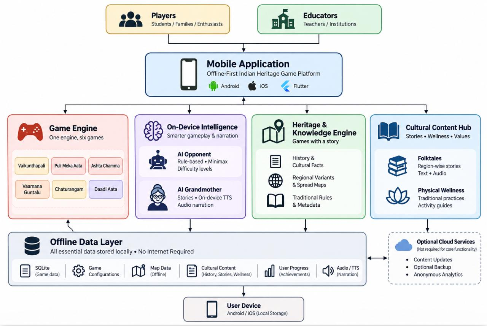

<div align="center">

# KREEDA · క్రీడ

### India's traditional games, fitness and stories — offline, private, and classroom-ready.

    



Built for **Smart India Hackathon (SIH) 2026**.

</div>

## Table of contents
- [About](#about)
- [Quick start](#quick-start)
- [What you get](#what-you-get)
- [Architecture](#architecture)
- [Project layout](#project-layout)
- [Demo script](#demo-script)
- [Commands](#commands)
- [Known limitations](#known-limitations)
- [Roadmap](#roadmap)

---

## About

KREEDA bundles six heritage board games, a guided Physical Wellbeing module (Yoga · Vyayam · Dhyana), and a library of illustrated folktales narrated by Grandmother. It is designed to run fully offline with zero accounts or servers — ideal for low-connectivity classrooms and community centres.

**Stack:** React + TypeScript + Vite + Tailwind (select modules), plain HTML/CSS/JS for the static hub and a few legacy pages, Web Speech API for narration, and `localStorage` for local progress.

---

## Quick start

From the `Kreeda/` folder you can run a tiny static server and open the hub:

```bash
python3 -m http.server 8000
# then open http://localhost:8000/kreeda-home.html
```

Notes:
- The hub and most pages open directly from disk (`file://`).
- `Puli Meka`, `Daadi Aata` and `Ashta Chamma` require a local server due to separate script files; the other modules use single-file builds and work from disk.

---

## What you get

- 🎲 Six traditional games with maps, tutorials, and AI opponents (Chaturangam, Vaikunthapali, Puli Meka, Daadi Aata, Vaamana Guntalu, Ashta Chamma).
- 🧘 Physical Wellbeing: a rule-based weekly plan builder, session player, and a library of practices with safety gating.
- 📖 Folktales: 12 illustrated stories, sentence-level narration, and an animated narrator.
- 🔒 Private & offline: no accounts, no server; all state stays on-device.

For short feature notes and engine details, see the original sections in this README (Games, Wellbeing, Folktales, Kreedu AI).

---

## Architecture

The app is a static hub that embeds independent, self-contained modules. Each module is deployable and buildable on its own so teams can work in parallel.


Key points:
- Modules communicate with the hub via `postMessage` when embedded as cards (`?embed=...`).
- Many React modules are built as single-file outputs so they work from disk without a server.
- No backend: AI and game logic run entirely in the browser; maps are pre-projected SVGs.

---

## Project layout

See the top-level structure and where to find each module and tool.

```
Kreeda/
  kreeda-home.html        Home: Games · Wellbeing · Folktales
  kreeda.html             Games page (cards, maps, tutorials)
  folktales.html          Folktales: library + reader
  chadarangam/            Chaturangam (React + engine)
  wellbeing/              Physical Wellbeing (React + plan engine)
  games/                  Per-game folders (vaikunthapali, puli-meka, ...)
  folktales/              Source stories, build tools and optional narration scripts
  assets/                 Shared artwork and media
  system-architecture.jpeg Architecture diagram (referenced above)
```

---

## Demo script (5–7 minutes)

1. Open `kreeda-home.html`, show offline behaviour.
2. Games → Chaturangam: tap map pins to show the game's journey; run a short match.
3. Show Vaikunthapali in Telugu and the board guide.
4. Open Wellbeing, build a weekly plan and start a timed session.
5. Folktales → play a story and show sentence-level narration.

---

## Commands

```bash
python3 -m http.server 8000   # serve the app locally from Kreeda/
cd chadarangam && npm install && npm run dev
cd wellbeing && npm run build
node folktales/build-stories.mjs  # rebuild stories.js after editing text
```

---

## Known limitations

- Some game modules use separate script files and therefore need a local server to work reliably.
- Folktales are English-only for the moment; multilingual support is planned.
- A small set of wellbeing demo animations and some history sources need verification.

---

## Roadmap

- Convert remaining games to single-file builds so the entire app opens from disk.
- Add multilingual support for stories and rules (Telugu, Hindi, Tamil, Kannada, Malayalam).
- Expand the story library and more heritage games.

---

If you'd like, I can:
- add a screenshot/gallery folder and reference thumbnails in this README
- create a compressed `system-architecture.webp` for faster loading
- open a PR with this change and include the image if you'd like me to add it here

Enjoy — tell me if you want a different tone, more visuals, or extra sections (contributing, license, credits).
