<div align="center">

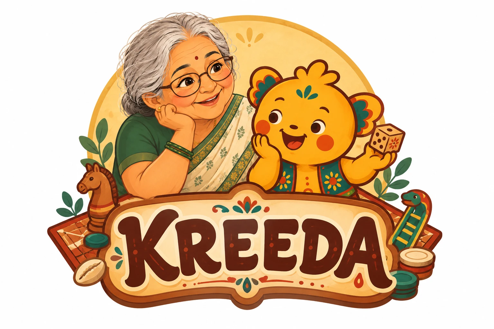

### క్రీడ · क्रीड़ा · கிரீடா · ക്രീഡ

**India's heritage games, movement traditions and folktales, in one offline-first playground.**

*Play the games your grandparents played. Move the way the akhadas trained. Hear the stories told under the banyan tree.*

<br/>


<br/>

[**The Games**](#-the-heritage-games) ·
[**Wellbeing**](#-physical-wellbeing) ·
[**Folktales**](#-folktales) ·
[**Architecture**](#-how-it-works) ·
[**Quick start**](#-quick-start)

</div>

<br/>

<p align="center">
  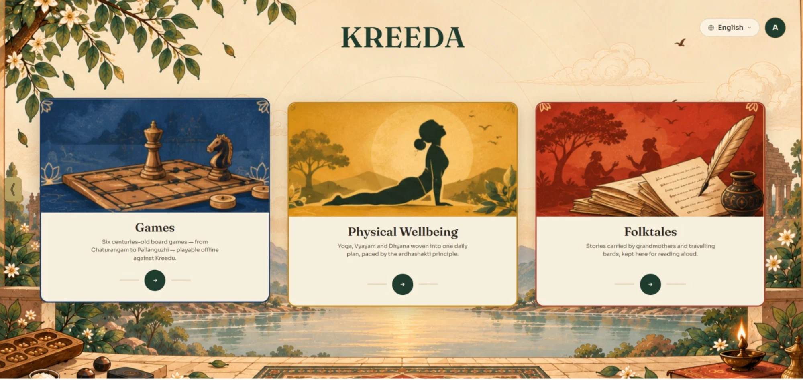
  <br/>
  <sub><i>The KREEDA home page: three doors into India's play, movement and story traditions.</i></sub>
</p>

---

## ✦ Why KREEDA?

Pallanguzhi boards gather dust, Puli Meka lines fade from temple floors, and the stories of Tenali Rama are told less often at bedtime. KREEDA brings them back as something children want to open on a screen.

It is a **browser-based cultural learning platform** for children, families and classrooms. Everything runs on the device, so there are **no accounts, no servers and no network calls during play**. That makes it usable in a village school with patchy internet just as well as in a city living room.

<table>
<tr>
<td width="33%" align="center"><h3>🎲</h3><b>6 heritage games</b><br/><sub>each with an AI opponent, rules tutorial and a world map of where the game travelled</sub></td>
<td width="33%" align="center"><h3>🧘</h3><b>3 wellbeing traditions</b><br/><sub>Yoga, Vyayam and Dhyana, with a personal weekly plan and guided sessions</sub></td>
<td width="33%" align="center"><h3>📜</h3><b>6 story collections</b><br/><sub>illustrated folktales read aloud by a storytelling grandmother</sub></td>
</tr>
<tr>
<td align="center"><h3>🌐</h3><b>5 languages</b><br/><sub>English · हिंदी · తెలుగు · தமிழ் · മലയാളം, one switch for the whole app</sub></td>
<td align="center"><h3>📴</h3><b>Offline-first</b><br/><sub>game logic, AI and plans all run in the browser</sub></td>
<td align="center"><h3>🎨</h3><b>One folk-art design system</b><br/><sub>aged-paper cream, maroon outlines and hand-painted scenes throughout</sub></td>
</tr>
</table>

---

## 🎲 The Heritage Games

<p align="center">
  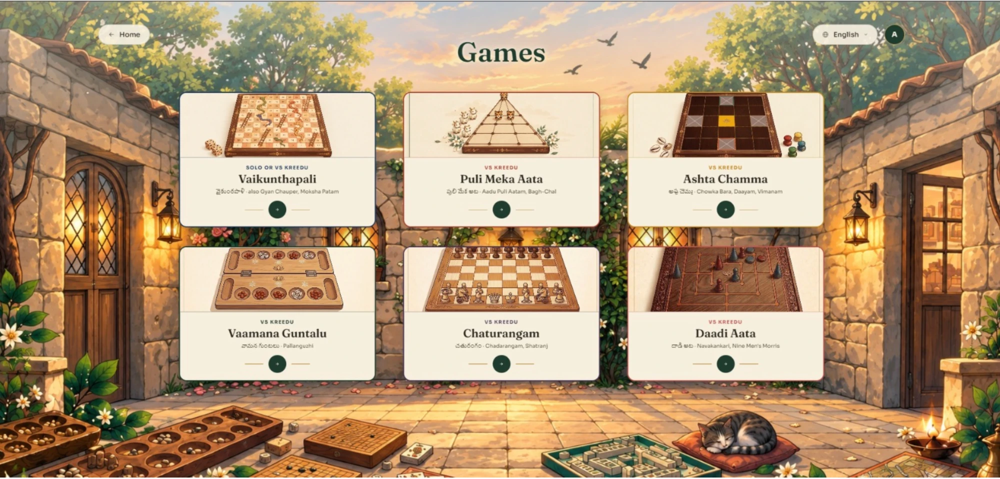
  <br/>
  <sub><i>The Games courtyard: six heritage games, each playable against Kreedu.</i></sub>
</p>

Every game opens onto an **illustrated world map**. Tap a pin to see what the game is called in that country, a fun fact about it, and the route it took to get there. Below the map are plain-language rules and an interactive tutorial, and then you play. When there's no second player, **Kreedu**, the mascot, steps in as your AI opponent.

<table>
<tr>
<td width="50%" valign="top">
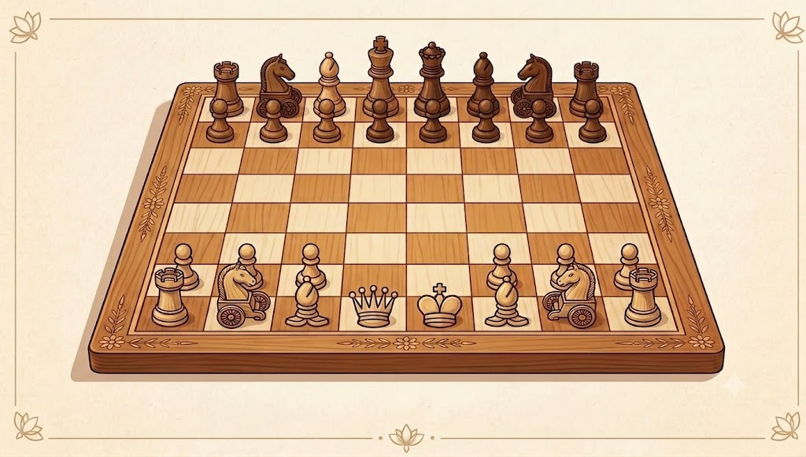
<h3>♟️ Chaturangam <sub>చతురంగం</sub></h3>
<sub><i>also Chadarangam, Shatranj</i></sub><br/>
The ancestor of chess. Play the ancient variant or modern chess against a real search engine using iterative deepening, PVS, null-move pruning, quiescence and Zobrist hashing. Three difficulty levels: <b>Sishya</b>, <b>Yodha</b> and <b>Senapati</b>. It also includes an era timeline tracing how Chaturangam became chess.
</td>
<td width="50%" valign="top">
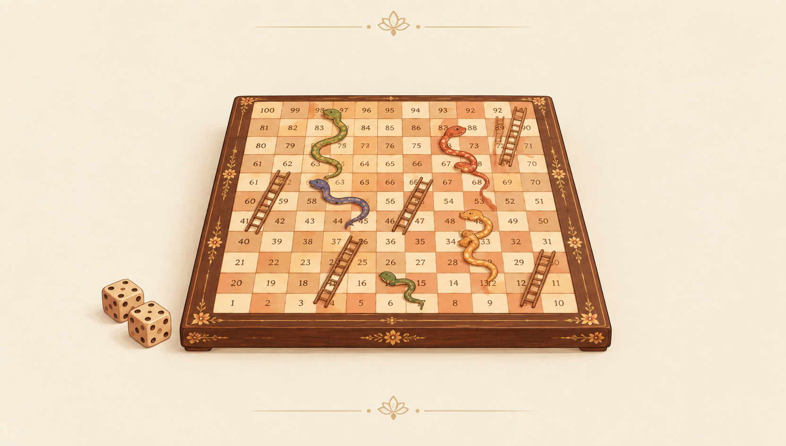
<h3>🐍 Vaikunthapali <sub>వైకుంఠపాళి</sub></h3>
<sub><i>also Gyan Chauper, Moksha Patam</i></sub><br/>
The original snakes and ladders, where virtues lift you toward Vaikuntha and vices send you sliding down. It has an animated die, a snake swarm and the moral meaning behind every square. Play solo or against Kreedu.
</td>
</tr>
<tr>
<td valign="top">
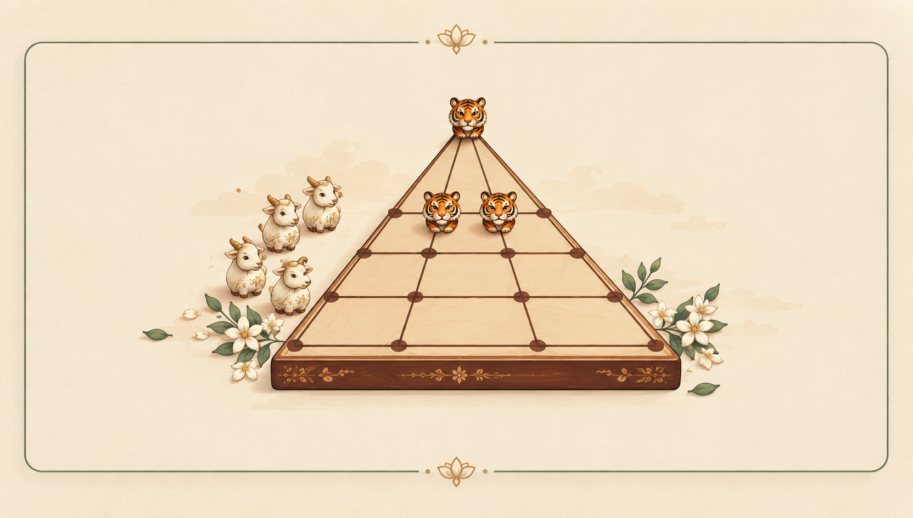
<h3>🐅 Puli Meka <sub>పులి మేక</sub></h3>
<sub><i>also Aadu Puli Aatam, Bagh-Chal</i></sub><br/>
Three tigers hunt fifteen goats. It's an asymmetric strategy game played for centuries on temple floors, Play <b>vs Kreedu</b> or pass-and-play.
</td>
<td valign="top">
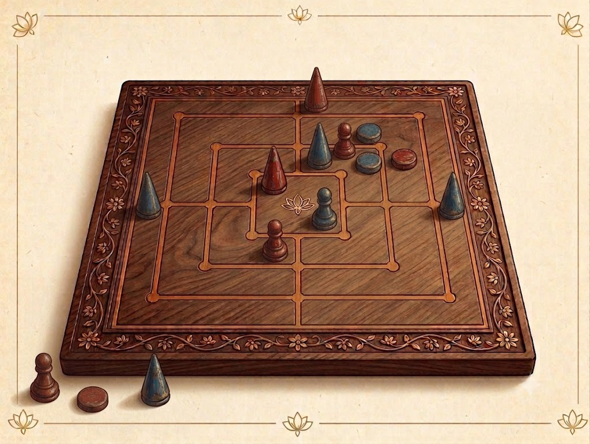
<h3>⚪ Daadi Aata <sub>దాడి ఆట</sub></h3>
<sub><i>also Navakankari, Nine Men's Morris</i></sub><br/>
India's take on the "mill" family (Nine Men's Morris). Line up three to capture. It has an AI opponent at <b>Easy / Medium / Hard</b>, plus a history page and a facts page.
</td>
</tr>
<tr>
<td valign="top">
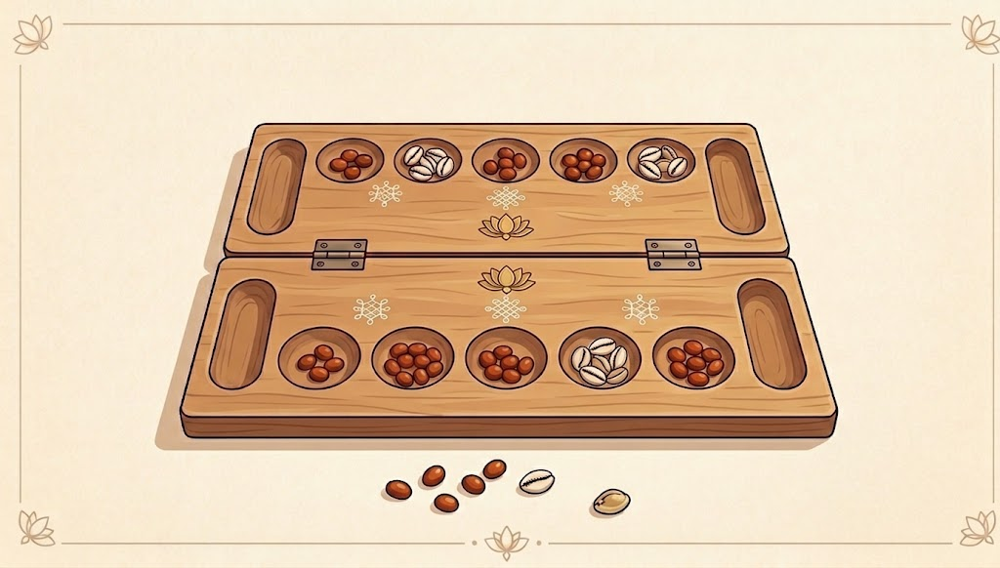
<h3>🪵 Vaamana Guntalu <sub>వామన గుంటలు</sub></h3>
<sub><i>also Pallanguzhi</i></sub><br/>
A mancala-style pit-and-seed game on a wooden board. The sowing is animated slowly so every seed can be followed as it moves.
</td>
<td valign="top">
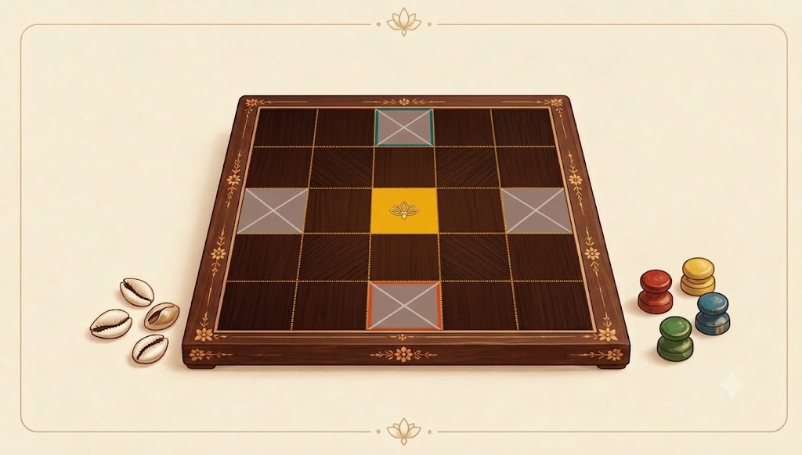
<h3>🐚 Ashta Chamma <sub>అష్టా చెమ్మా</sub></h3>
<sub><i>also Chowka Bara, Daayam, Vimanam</i></sub><br/>
A race-home game played with cowrie shells on a 5×5 board. It is one of the oldest ancestors of Ludo.
</td>
</tr>
</table>

---

## 🧘 Physical Wellbeing

<p align="center">
  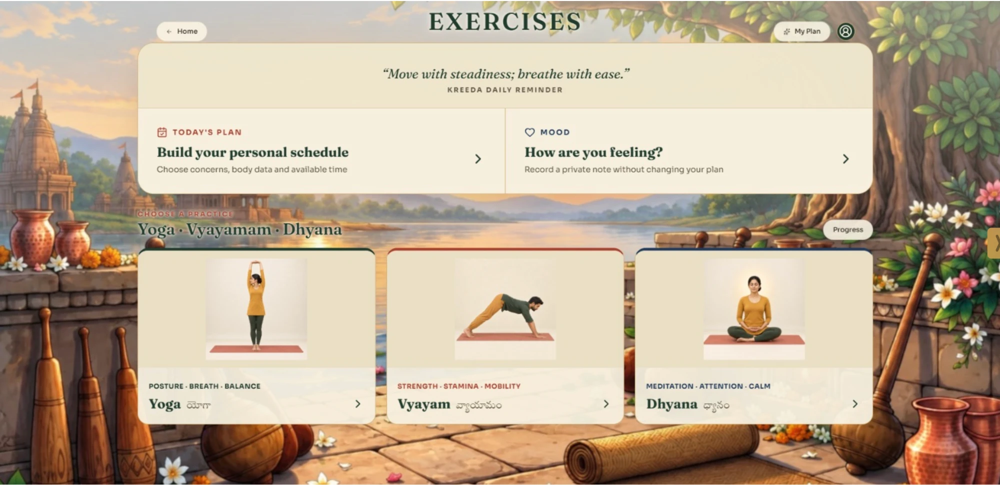
  <br/>
  <sub><i>Today's plan, a mood check-in, and the three practice paths.</i></sub>
</p>

Three living traditions, taught safely and progressively:

| | Tradition | What's inside |
|:-:|---|---|
| 🧘‍♀️ | **Yoga** | Asanas with step-by-step images and GIFs, pranayama (Nadi Shodhana, Bhramari, Kapalabhati…), history from Patanjali to International Yoga Day |
| 💪 | **Vyayam** | Dand, Baithak, Sapate and mobility drills, plus the heritage of the akhada: gada, mudgar, mallakhamb, kushti, Kalaripayattu and the Great Gama |
| 🕯️ | **Dhyana** | Meditation across Buddhist, Vedic, Jain and Yogic lineages: Vipassana, Anapana, Trataka, Preksha, Maitri, walking meditation and more |

**Features**

- 🗓️ **Deterministic weekly plan builder** tailored to your focus areas, fitness level, age, daily minutes and days per week
- 🛡️ **Safety and contraindication checks** before any practice is suggested
- 🔓 **Progressive unlocks**, so harder practices open up as you build consistency
- ⏱️ **Guided, timed session player** with audio cues and step viewer
- 😊 **Mood check-ins** before and after sessions, with a local progress history
- 🗺️ **Spread map** showing how each practice travelled the world

> [!NOTE]
> The Wellbeing module is educational and makes **no medical claims**. Profiles, plans, moods and history never leave the browser.

---

## 📜 Folktales

<p align="center">
  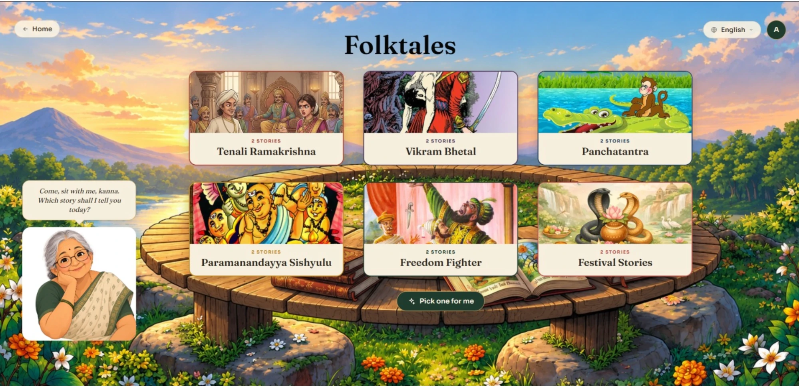
  <br/>
  <sub><i>"Come, sit with me, kanna. Which story shall I tell you today?"</i></sub>
</p>

Pull up a seat. A storytelling grandmother narrates each tale **sentence by sentence** using the browser's Web Speech API, and each sentence is highlighted as she reads it. Can't decide? Tap **Pick one for me**.

| Collection | Sample tales |
|---|---|
| 🐒 **Panchatantra** | *The Clever Monkey* · *The Blue Jackal* |
| 👑 **Tenali Ramakrishna** | *The Handful* · *The Biggest Fool* |
| 🧟 **Vikram–Betal** | *The Three Suitors* · *The Sacrifice* |
| 🎓 **Paramanandayya Sishyulu** | *The Needle* · *Pearls of Laughter* |
| ⚔️ **Freedom Fighters** | *Shivaji and Afzal Khan* · *The Disguise* |
| 🪔 **Festival Stories** | *Naga Panchami* · *Bathukamma* |

---

## 🏛️ How it works

<p align="center">
  
</p>

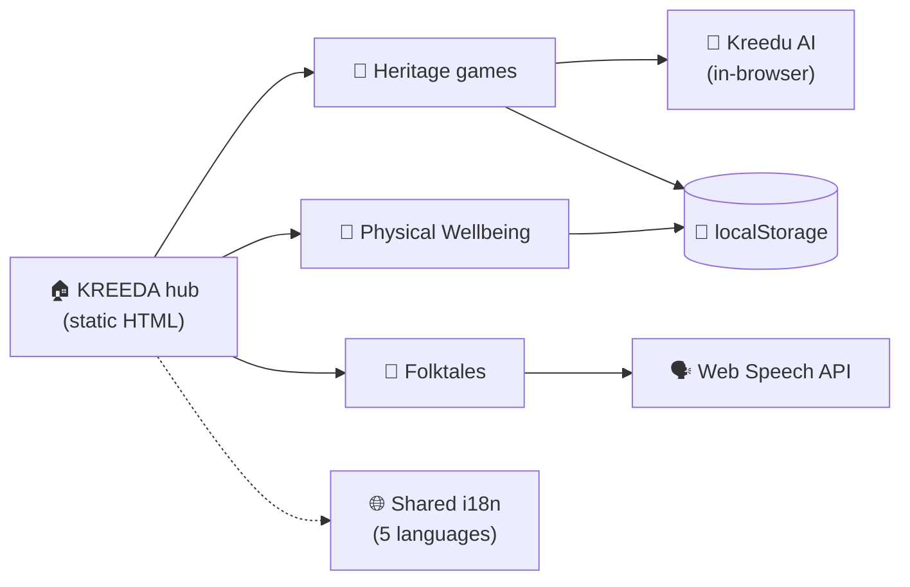

- **Static hub.** `index.html`, `kreeda.html` and `folktales.html` provide navigation and the shared visual language.
- **Independent modules.** Each React + TypeScript game or module is built separately with Vite and embedded in the hub through a `postMessage` integration.
- **Everything client-side.** Game rules, AI search and wellbeing plan selection all run in the browser.
- **One language switch.** `js/i18n.js` stores the choice under `kreeda-lang` and passes it to every embedded module via `?lang=`.

---

## 🚀 Quick start

> **Prerequisites:** Python 3, or any static file server. Every module ships pre-built, so there is **no build step** to play.

**1. Clone and serve** from the repository root:

```bash
git clone https://github.com/VijayaY836/Kreeda.git
cd Kreeda
python3 -m http.server 8000
```

**2. Open** <http://localhost:8000> and start playing.

Because KREEDA is plain static files, the same folder deploys as-is to any static host (GitHub Pages, Netlify, a school LAN server).

<details>
<summary><b>🛠️ Developing an individual module</b></summary>

<br/>

| Module | Command | URL |
|---|---|---|
| Chaturangam | `cd chadarangam && npm i && npm run dev` | <http://localhost:3001> |
| Physical Wellbeing | `cd wellbeing && npm i && npm run dev` | <http://localhost:3002> |
| Daadi Aata / Puli Meka | `cd games/<name> && npm i && npm run dev` | <http://localhost:3000> |
| Vaikunthapali | `cd games/vaikunthapali && npm i && npm run dev` | Vite default |

Each module's built `dist/` is committed, because the hub links straight to it. After changing a module's `src/`, type-check, rebuild and commit its `dist/`:

```bash
npm run lint && npm run build
```

After editing folktale sources, regenerate the story data:

```bash
node folktales/build-stories.mjs
```

</details>

<details>
<summary><b>📁 Project layout</b></summary>

<br/>

```text
Kreeda/
├── index.html           🏠 Home hub: Games, Wellbeing, Folktales
├── kreeda.html          🎲 Games catalogue and world maps
├── folktales.html       📜 Folktale library and narrated reader
│
├── assets/
│   ├── images/          Hub artwork, mascot and storyteller
│   │   └── games/       Game card thumbnails
│   └── world-atlas.js   World map data for the game maps
├── js/                  Shared i18n and per-game world-map scripts
│
├── chadarangam/         ♟️ Chaturangam (React) + chess/chaturanga engine
├── wellbeing/           🧘 Yoga, Vyayam and Dhyana (React)
├── games/
│   ├── ashta-chamma/    🐚 Ashta Chamma (React)
│   ├── daadi-aata/      ⚪ Daadi Aata (React)
│   ├── puli-meka/       🐅 Puli Meka (React)
│   ├── vaikunthapali/   🐍 Vaikunthapali (React)
│   └── vamana-guntalu/  🪵 Vaamana Guntalu (single HTML page)
├── folktales/           Story sources, generated data, build and narration scripts
│
└── docs/images/         Logo, screenshots and architecture diagram
```

</details>

---

## 🔒 Privacy by design

| | |
|---|---|
| 👤 | No account, no sign-in, no tracking |
| 🖥️ | No backend is required to play, read or practise |
| 💾 | Plans, moods, progress and preferences stay in browser `localStorage` |
| 🗣️ | Narration uses the browser's on-device Web Speech voices when available |

---

## 🗺️ Roadmap

- [x] Six playable heritage games with AI opponents and world maps
- [x] Yoga, Vyayam and Dhyana with a weekly plan builder
- [x] Narrated folktale library
- [x] Five-language support across the hub
- [ ] More regional languages (ಕನ್ನಡ, मराठी, বাংলা…)
- [ ] Migrate remaining legacy game pages to consistent Vite builds
- [ ] Grow the folktale and heritage-game collections
- [ ] Reviewed movement animations and classroom facilitation tools

---

## 🤝 Contributing

Contributions are welcome. A few guidelines keep KREEDA coherent:

1. **Stay local-first.** Don't add network dependencies at play time.
2. **Cite your sources**, especially for historical and health-related content.
3. **Respect the design system**: cream paper, maroon outlines, Fraunces and Manrope type, and Kreedu.
4. **Test the module you touched** with `npm run lint && npm run build`.

---

<div align="center">

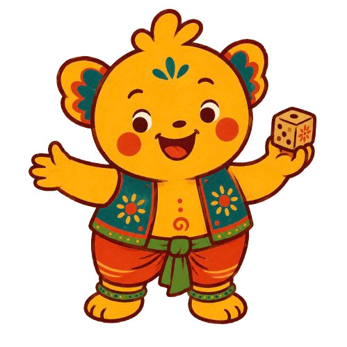

**Made with ❤️ for Smart India Hackathon 2026**

<sub><i>"Kreeda" (క్రీడ / क्रीड़ा) means play, as in the play that teaches.</i></sub>

</div>
